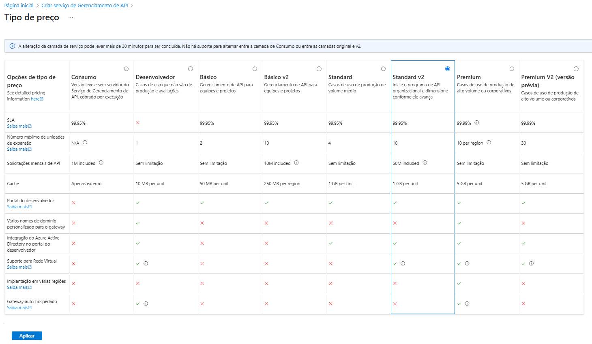

# Guia Abrangente de Azure API Management

Este documento serve como um guia detalhado sobre o uso do Azure API Management, com foco na criação de App Services, práticas recomendadas para desenvolvimento de endpoints, e implementação de autenticação com JWT. Descreveremos também insights valiosos e as possibilidades ampliadas que essas tecnologias proporcionam.

## Índice

1. [App Services](#app-services)
2. [Boas Práticas na Criação de Endpoints](#boas-práticas-na-criação-de-endpoints)
3. [Autenticação com JWT](#autenticação-com-jwt)
4. [Custos](#custos)
5. [Insights e Possibilidades](#insights-e-possibilidades)

---

## App Services

Os App Services no Azure oferecem uma plataforma robusta e versátil para a construção de aplicações web, APIs, e aplicativos móveis. Eles proporcionam uma infraestrutura otimizada que simplifica o desenvolvimento e a escalabilidade.

### Resumo Detalhado
- **Escalabilidade Automática**: Os App Services permitem que você ajuste automaticamente a capacidade do servidor, garantindo assim que seu aplicativo possa lidar com picos de demanda sem comprometer o desempenho.
- **Suporte Multilinguagem**: Oferece compatibilidade com múltiplas linguagens de programação, incluindo .NET, Java, Node.js, PHP, e Python, facilitando a implementação de soluções diversificadas.
- **Monitoramento Robusto**: As ferramentas de monitoramento integradas oferecem insights valiosos sobre o desempenho do aplicativo, possibilitando ajustes precisos e proativos para otimização.

### Insights
- **Integração com Azure DevOps**: A automação dos processos de integração e entrega contínua (CI/CD) acelera o desenvolvimento e a implantação, diminuindo o tempo de inatividade.
- **Segurança Avançada**: A aplicação de certificados SSL/TLS fortalece a proteção dos dados em trânsito, ao mesmo tempo oferecendo uma experiência segura para os usuários.

## Boas Práticas na Criação de Endpoints

O design cuidadoso de endpoints é crucial para o desempenho e segurança das APIs. Seguir práticas recomendadas assegura que sua API seja escalável, segura e fácil de usar.

### Resumo Detalhado
- **Versionamento Estruturado**: Implementar versionamento nos endpoints assegura que alterações na API não quebrem funcionalidades existentes. Isso é fundamental para manter a compatibilidade com clientes antigos e novos.
- **Limitação de Taxas (Rate Limiting)**: Implementar políticas para limitar o número de chamadas à API reduz riscos de abuso, protegendo contra sobrecargas e assegurando disponibilidade contínua.
- **Caching Eficiente**: A utilização de cache melhora significativamente o desempenho, reduzindo a carga no servidor e melhorando a velocidade de resposta para os usuários finais.

### Insights
- **Documentação Abrangente**: Ferramentas como Swagger ou OpenAPI são essenciais para criar documentações detalhadas e interativas, que ajudam no uso e na integração de sua API por terceiros.
- **Consistência no Design**: Manter um design de URI consistente e lógico facilita para os desenvolvedores a utilização da API, melhorando a experiência do usuário e minimizando erros.

## Autenticação com JWT

JSON Web Tokens (JWT) são amplamente utilizados por sua segurança e facilidade na transmissão de informações entre partes de forma confiável e compacta.

### Resumo Detalhado
- **Segurança e Integridade**: JWTs garantem que os dados não são alterados durante a transmissão, fornecendo uma base segura para autenticação e autorização.
- **Simplicidade de Implementação**: A estrutura leve e baseada em texto de JWTs permite uma fácil integração e manipulação, o que é ideal para sistemas distribuídos e arquiteturas microserviços.
- **Capacidade de Escalonamento**: Ao serem auto-contidos, os tokens JWT podem suportar escalonamentos verticais e horizontais com facilidade, sem a necessidade de armazenamento de sessão no servidor.

### Insights
- **Expiração Rigorosa de Tokens**: Definir expirações variadas para tokens aumenta a segurança geral do sistema e minimiza os riscos associados a roubo e reutilização de tokens.
- **Renovação Dinâmica**: A utilização de mecanismos de renovação de tokens garante que os usuários possam continuar a sessão sem interrupções enquanto mantém uma camada adicional de segurança ativa.

## Custos

Analisar os custos associados ao uso do Azure API Management é crucial para planejamento financeiro e otimização de recursos.

### Análise Crítica

Os preços praticados pelo Azure para serviços de API Management podem ser considerados elevados, especialmente para pequenas e médias empresas. A plataforma oferece diversos planos, desde o básico até ofertas premium, cada um com suas próprias características e capacidades.

- **Plano Básico**: Adequado para testes e ambientes de desenvolvimento, mas pode não atender às necessidades de produção.
- **Planos Premium**: Oferecem recursos avançados e maior capacidade de processamento, mas o custo pode ser proibitivo para algumas organizações.

### Considerações

1. **Custo-Benefício**: Avaliar se os recursos oferecidos justificam o investimento, considerando possíveis alternativas mais econômicas no mercado.
2. **Escalabilidade**: Enquanto a escalabilidade é um dos pontos fortes do Azure, o custo pode aumentar rapidamente com o crescimento da demanda.
3. **Transparência de Custos**: É essencial monitorar os custos em tempo real e ajustar o uso para evitar surpresas na fatura ao final do mês.

## Insights e Possibilidades

- **Ampla Integração**: Explorar a integração com serviços como o Azure Active Directory aprimora a segurança, permitindo controle refinado de acesso e autenticação unificada.
- **Monitoramento Detalhado com Application Insights**: Esta ferramenta oferece um monitoramento avançado, ajudando a identificar gargalos de desempenho e erros de forma pró-ativa em tempo real.
- **Inovação e Futuro**: Combine API Management com iniciativas de IoT e análise de dados para expandir as capacidades das aplicações, se preparando para o futuro da tecnologia interconectada.

---

Para mais informações, consulte a [documentação oficial do Azure](https://azure.microsoft.com/documentation) {target="_blank"}.

Notas

Imagens: Certifique-se de substituir os links das imagens com URLs apropriadas.
Preços Atuais: Verificar os preços atuais do Azure no site oficial, pois eles estão sujeitos a alterações periódicas.

By Adriano Santana.